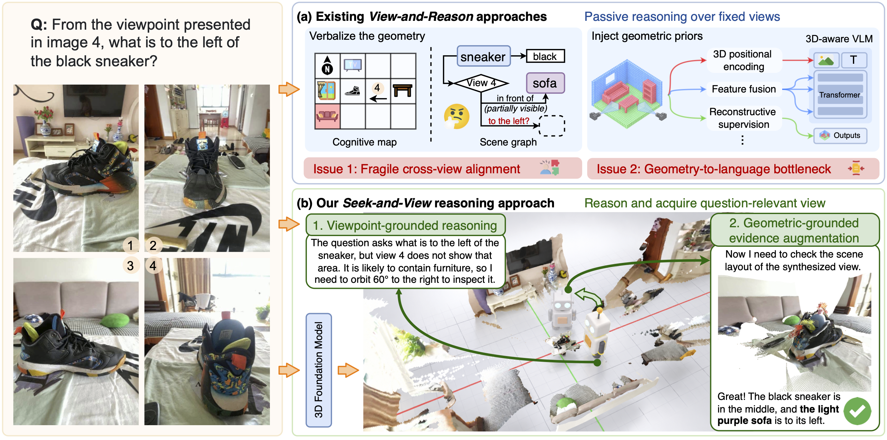

<h1 align="center"><strong>Seek-and-View Reasoning for <br> Multi-view Spatial Understanding</strong></h1>

<p align="center">
    <a>Qixiang Chen</a><sup>1</sup>,
    <a>Cheng Zhang</a><sup>1</sup>,
    <a>Fucai Ke</a><sup>1</sup>,
    <a>Chi-Wing Fu</a><sup>2</sup>,
    <a>Jianfei Cai</a><sup>1</sup>,
    <a>Jingwen Ye</a><sup>1</sup>
</p>

<p align="center">
    <sup>1</sup>Monash University,
    <sup>2</sup>The Chinese University of Hong Kong
</p>

<p align="center">
    <a href="https://arxiv.org/abs/2610.11810">📄 Paper</a>  |
    <a href="https://seekandview2026.github.io/">🌐 Homepage</a>
</p>

<div style="text-align: center;">
    
</div>

Existing multi-view spatial reasoning largely follows a **view-and-reason** paradigm, where models reason over sparse and fixed observations. This setting exposes two key issues in current VLMs: fragile cross-view alignment and the geometry-to-language bottleneck. To alleviate these issues, we introduce a **seek-and-view** reasoning paradigm and propose **Vantage**, a training-free and model-agnostic framework that advances multi-view spatial understanding through **question-relevant, evidence-seeking, and reasoning-oriented visual evidence acquisition**.

## Quick start

1. **Install** the pipeline environment, G3T and a vLLM environment:
   [docs/install.md](docs/install.md).
2. **Download** the benchmarks into `data/`: [docs/dataset.md](docs/dataset.md).
3. **Run**:

   ```bash
   VLLM_PYTHON=envs/vllm-0.11/bin/python VANTAGE_PIPELINE_PYTHON=envs/vantage_pipeline/bin/python \
       bash scripts/run.sh qwen3-vl-8b mindcube vantage
   ```

See [docs/usage.md](docs/usage.md) for configuration and the output format.


## Acknowledgements

Vantage builds on the [GCA](https://github.com/gca-spatial-reasoning/gca) codebase
and uses [G3T](https://github.com/g3t-paper/g3t) for 3D reconstruction. We thank
their authors for releasing their code and models.

## Citation
If you find this work interesting or relevant to your research, please consider citing our paper 😊
```bibtex
@misc{chen2026seekandviewreasoningmultiviewspatial,
      title={Seek-and-View Reasoning for Multi-View Spatial Understanding}, 
      author={Qixiang Chen and Cheng Zhang and Fucai Ke and Chi-Wing Fu and Jianfei Cai and Jingwen Ye},
      year={2026},
      eprint={2610.11810},
      archivePrefix={arXiv},
      primaryClass={cs.CV},
      url={https://arxiv.org/abs/2610.11810}, 
}
```
